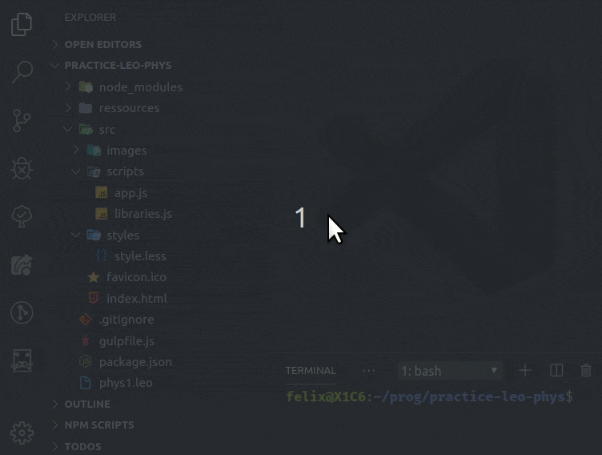
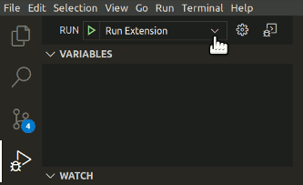

# leojs

##  Literate Editor with Outline _in Typescript_ 

### Literate Programming with _Directed Acyclic Graphs_ ([dag](https://en.wikipedia.org/wiki/Directed_acyclic_graph))

LeoJS is [LeoInteg](https://github.com/boltex/leointeg#-leo-editor-integration-with-visual-studio-code)'s younger sibling project : a vsCode extension, currently in early alpha.

Inspired by <https://github.com/leo-editor/leo-editor/issues/1025>.

See Leo, the Literate Editor with Outline, at [leoeditor.com](https://leoeditor.com/)
or on [github](https://github.com/leo-editor/leo-editor), and vscode at [code.visualstudio.com](https://code.visualstudio.com/).

## Development Version Installation

Make sure you have Node.js and Git installed, then clone the sources and run `npm install` in a terminal to install the remaining development dependencies.

You can then run the **Run Extension** target, as shown above, in the **Debug View**.

## Features done so far

The 'demo' built so far creates two test commanders at startup, (in leoUi constructor) with their respective outlines.

Also, you can turn on the 'leo tree browsing mode' (Leo/MORE outliner keybindings) on and off.

## Keybindings

| Commands Keybinding        |     |                         | Command             |
| :------------------------- | :-- | :---------------------- | :------------------ |
| `Alt + -`                  |     |                         | Contract All        |
| `Ctrl + I`                 |     |                         | Insert Node         |
| `Ctrl + H`                 |     |                         | Edit Headline       |
| `Ctrl + Backquote`         |     |                         | Clone Node          |
| `Ctrl + Shift + C`         |     |                         | Copy Node           |
| `Ctrl + Shift + X`         |     |                         | Cut Node            |
| `Ctrl + Shift + V`         |     |                         | Paste Node          |
| `Ctrl + Shift + Backspace` |     |                         | Delete Node         |
| `Ctrl + B`                 |     |                         | Execute Script      |
| `Ctrl + M`                 |     |                         | Mark / Unmark       |
| `Ctrl + {`                 | and | `Ctrl + }`              | Promote / Demote    |
| `Ctrl + T`                 |     |                         | Toggle Outline/Body |
| `Tab`                      | or  | `Alt + D`               | Focus on Body       |
| `Alt + T`                  |     |                         | Focus on Outline    |
| `Ctrl + Shift + D`         |     |                         | Extract             |
| `Ctrl + Shift + N`         |     |                         | Extract Names       |
| `Alt + A`                  |     |                         | Sort Siblings       |
| `Ctrl + U`                 | or  | `Shift [+ Alt] + Up`    | Move Outline Up     |
| `Ctrl + D`                 | or  | `Shift [+ Alt] + Down`  | Move Outline Down   |
| `Ctrl + L`                 | or  | `Shift [+ Alt] + Left`  | Move Outline Left   |
| `Ctrl + R`                 | or  | `Shift [+ Alt] + Right` | Move Outline Right  |

> Move Outline commands only need the 'Alt' key modifier when focus is on body pane.

### Tree Browsing Keybindings

> _With the **'Leo Tree Browsing'** setting enabled, all arrows and numeric keypad keys change the outline's selection directly_

| Tree Browsing Keybinding |     | With **'Leo Tree Browsing'** enabled | Command                  |
| :----------------------- | :-- | :----------------------------------- | :----------------------- |
| `Alt + Home`             | or  | `Home`                               | Go To First Visible Node |
| `Alt + End`              |     |                                      | Go To Last Sibling       |
|                          |     | `End`                                | Go To Last Visible Node  |
| `Alt + N`                |     |                                      | Go To Next Clone         |
| `Alt + Arrow Keys`       | or  | `Arrow Keys`                         | Browse Tree              |
| `Ctrl + T`               |     |                                      | Switch Tree/Body Focus   |
| `Tab`                    |     |                                      | Focus from Tree to Body  |

**Enjoy!**
