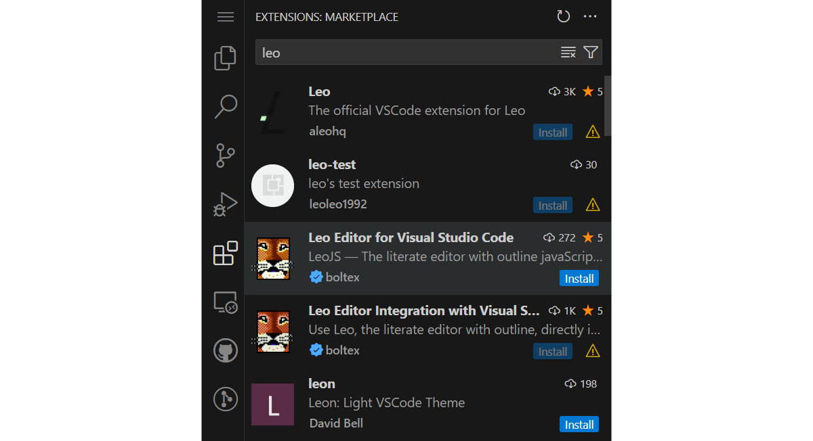

# Installing LeoJS

LeoJS is implemented as a Visual Studio Code (_VSCode_ or _VSCodium_) extension, and uses its UI expose all of Leo's fundamental functionality. So head over to [code.visualstudio.com](https://code.visualstudio.com/) or [vscodium.com](https://vscodium.com/) first to download either of those if not already present on your system.

> 🌐 **Browser-based Editor**\
> As showcased in the [LeoJS Features Demo](https://www.youtube.com/watch?v=M_mKXSbVGdE) video, you can also install and use LeoJS in [VSCode for the web](https://code.visualstudio.com/docs/remote/codespaces#_browserbased-editor).

The easiest way to install LeoJS is to open the **Extension View** `Ctrl+Shift+X`, type _leo_ to search for the LeoJS extension in the marketplace, and then clicking its **Install** button.

\
_The Extension View showing the LeoJS extension_

Alternatively, you can also download the .vsix extension file independantly, directly at the [Microsoft Marketplace](https://marketplace.visualstudio.com/items?itemName=boltex.leojs) or the [Open VSX Registry](https://open-vsx.org/extension/boltex/leojs), and install the LeoJS extension manually with the `Extension: Install from VSIX` command in VSCode.

After LeoJS installs for the first time, the Welcome page and the Leo Log Window should then become visible:

\
_LeoJS showing its welcome page after starting up for the first time_
