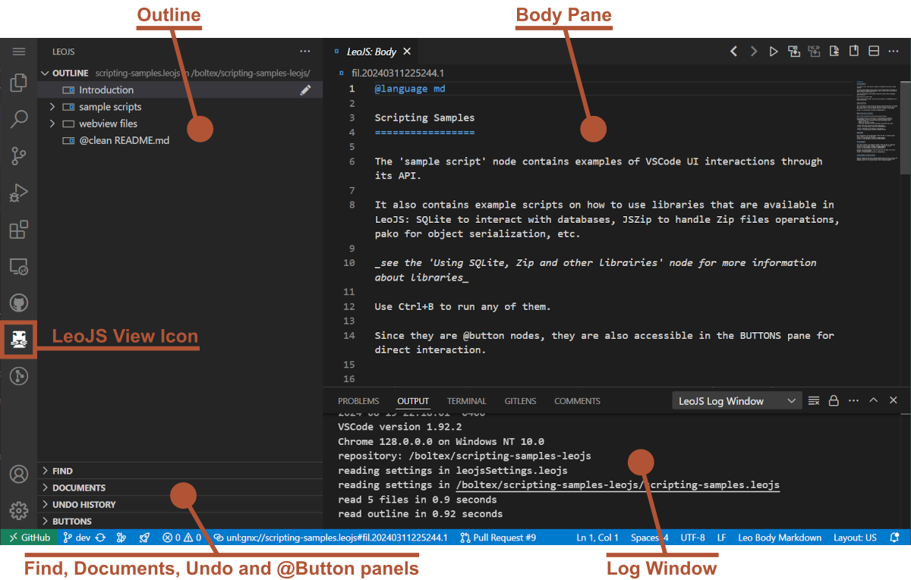
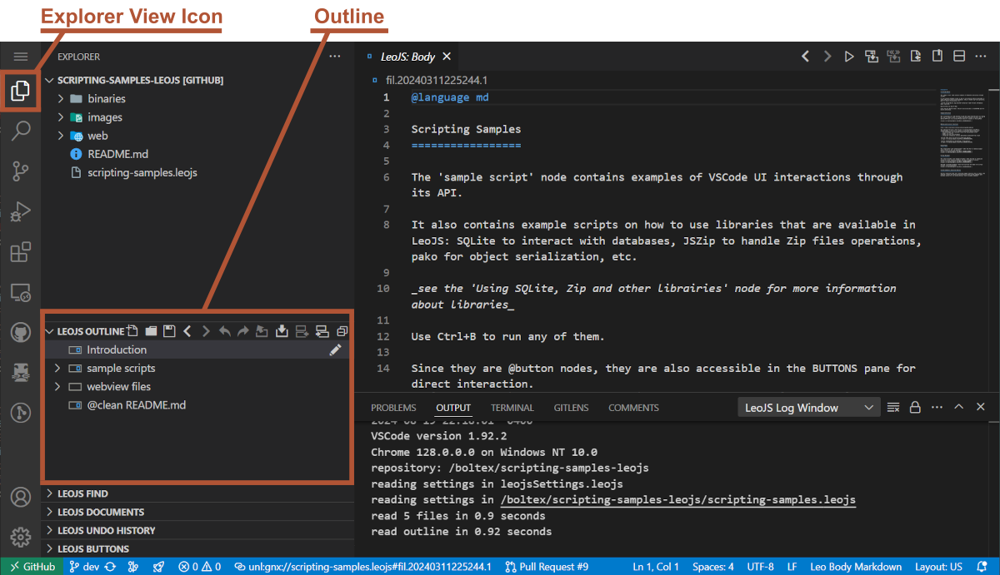
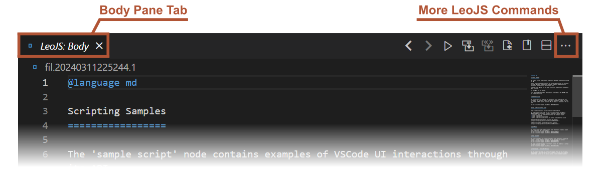
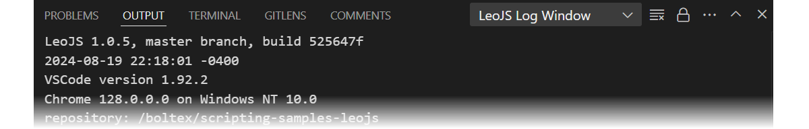

# Leo in 10 Minutes

An introduction to the interface, its most important features and terminology.

\
_LeoJS UI panels are located in the LeoJS sidebar view (pictured above),  and are also mirrored in the Explorer view_

## User Interface

Leo stores all data in nodes. Nodes have headlines (shown in the outline pane) and body text. The body pane shows the body text of the presently selected node, the node whose headline is selected in the outline pane. Headlines have an icon box indicating a node’s status. 

As already stated, the  **Leo Outline** is visible in the standalone LeoJS View, but also in the Explorer View, below the file explorer:

\
_The Leo Outline panel shown in the sidebar's Explorer View_

The **body pane** is a text editor which changes to match the selected node of the Leo outline.

> 💡 **TIP**\
> **Detached Body Panes**, independent of the selected node, can be opened with the 'Open Aside' command from any node.
> 

Below the outline pane are more panels, such as the **Find** panel to help navigate the outline, the **Documents** panel to manage the currently opened Leo documents, an **undo** pane for a history of past actions, and a **buttons** pane.

Finally, a **Log Window** [output channel](https://code.visualstudio.com/api/extension-capabilities/common-capabilities#output-channel) shows text output from LeoJS commands, or from running scripts.

## Find Panel

The Find tab shows the status of Leo’s Find/Replace commands. It can be shown and expanded with the **`Ctrl+F`** shortcut while the focus is in the Leo outline or body pane.

Enter your search pattern directly in the **\<find pattern here\>** field. Press **`Enter`** to find the first match starting from your current position.

Hitting **`F3`** repeatedly will find the subsequent matches. (**`F2`** for previous matches)

Using the Nav tab of the _find panel_, (**`Ctrl+Shift+F`** to accesss directly) you can type your search pattern in the **Nav** field instead to see all results appear below. This will show the headlines as you type.

Press **`Enter`** to freeze the results and show results also found in **body text of any node**. This will add a snowflake icon ❄️ to the **Nav** field.

If you check the **Tag** option, the **Nav** field is then used to find nodes by their tag 🏷 _ua_ (user attribute).

## Leo Documents Panel

This panel shows the currently opened Leo Documents in LeoJS. Select which one is shown by clicking on it, or cycle with `Ctrl+Tab`.

## Undo Panel

There are undo and redo icons above the Leo outline and above the undo pane itself. You can also right-click on an undo step to directly switch to that specific state.

> 📌 **NOTE**\
> The undo functionality is a multi-tiered system that separates structural outline changes from text changes within the body pane. 

The Undo Panel captures outline alterations as individual 'Undo Beads', independent from VS Code's native text undo states. With focus in the body pane, the Undo keybinding triggers VS Code's text-specific undo action. However, once the focus shifts, or a new node is selected, all concurrent text changes coalesce into a single 'Undo Bead' within the Undo Panel. 

## Buttons Panel

Scripts can be assigned to reusable commands or buttons. Those are displayed in this panel.

## Commands

Leo has hundreds of commands, described in [Leo's Command Reference](../users-guide/commands-reference.md)

The more common commands are accessible through the user interface — toolbar buttons, icon menus, and [key bindings](../users-guide/commands-reference.md#key-reference). Those commands also discoverable via the VSCode Command Palette. (accessible through F1 or Ctrl+Shift+P)

The complete set of commands is discoverable in its entirety through Leo's own command palette: [Leo's minibuffer](../users-guide/commands-reference.md#executing-commands-from-the-minibuffer) via `Alt+X`.

> 💡 **TIP**\
> **There is no need to remember the exact names of Leo’s commands.** Instead, you only need to remember a few common command prefixes.