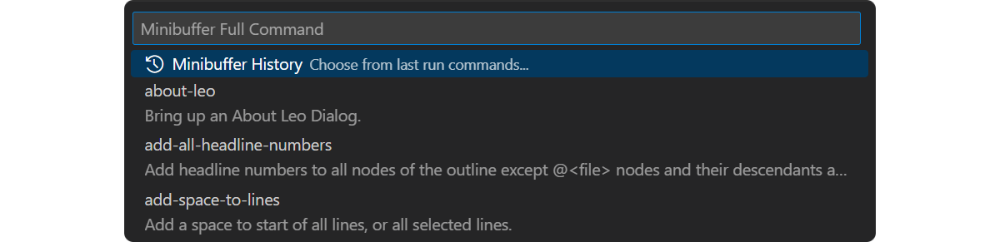

# Leo in 10 Minutes

This page aims to go over the interface, its most important features and terminology, to get you going in a few minutes! **For a quick overview, see the [Introduction to Leo 📺](https://www.youtube.com/watch?v=j0eo7SlnnSY) video.**

\
_LeoJS UI panels are located in the LeoJS sidebar view (pictured above), and are also mirrored in the Explorer view_

## User Interface

As stated above the _LeoJS Outline and UI panels_ are visible in the standalone LeoJS View, but **also in the Explorer View**, below the file explorer:

\
_The Leo Outline panel shown in the sidebar's Explorer View_

Leo stores all data in nodes. Nodes have headlines (shown in the outline pane) and body text. The body pane shows the body text of the presently selected node, the node whose headline is selected in the outline pane. Headlines have an icon box indicating a node’s status. 

The **body pane** is a text editor which changes to match the selected node of the Leo outline.


> 💡 **TIP**\
> **Detached Body Panes**, are panels like the body pane, but independent of the selected node. They can be opened with the 'Open Aside' command from any node.
> 

Below the outline pane are more panels, such as the **Find** panel to help navigate the outline, the **Documents** panel to manage the currently opened Leo documents, an **undo** pane for a history of past actions, and a **buttons** panel for easy access to your document's scripts.

Finally, a **Log Window** [output channel](https://code.visualstudio.com/api/extension-capabilities/common-capabilities#output-channel) is present at the bottom of the window.


### Find Panel

The Find tab shows the status of Leo’s Find/Replace commands. It can be shown and expanded with the **`Ctrl+F`** shortcut while the focus is in the Leo outline or body pane.


Enter your search pattern directly in the **\<find pattern here\>** field. Press **`Enter`** to find the first match starting from your current position.

Hitting **`F3`** repeatedly will find the subsequent matches. (**`F2`** for previous matches)

Using the Nav tab of the _find panel_, (**`Ctrl+Shift+F`** to accesss directly) you can type your search pattern in the **Nav** field instead to see all results appear below. This will show the headlines as you type.


Press **`Enter`** to freeze the results and show results also found in **body text of any node**. This will add a snowflake icon ❄️ to the **Nav** field.

If you check the **Tag** option, the **Nav** field is then used to find nodes by their tag 🏷 _ua_ (user attribute).

### Leo Documents Panel

Leo documents can be saved in three possible formats: in _XML_ as **.leo** files, in _JSON_ as **.leojs** files, and in database form as _sqlite_ **.db** files.


This panel shows the currently opened Leo Documents in LeoJS. Select which one is shown by clicking on it, or cycle with `Ctrl+Tab`.

### Undo Panel

There are undo and redo icons above the Leo outline and above the undo pane itself. You can also right-click on an undo step to directly switch to that specific state.


> 📌 **NOTE**\
> The undo functionality is a multi-tiered system that separates structural outline changes from text changes within the body pane.

### Buttons Panel

Scripts can be assigned to reusable commands or buttons. Those are displayed in this panel.


## Commands

Leo has hundreds of commands, described in [Leo's Command Reference](../users-guide/commands.md)

A curated set of common commands are accessible through the VSCode UI — toolbar buttons, icon menus, and [key bindings](../users-guide/commands.md#key-reference). Those commands are discoverable via the [VSCode Command Palette](https://code.visualstudio.com/docs/getstarted/userinterface#_command-palette). (accessible through `F1` or `Ctrl+Shift+P`)

With `Alt+X`, the complete set of commands is discoverable in its entirety through Leo's own command palette: [Leo's minibuffer](../users-guide/commands.md#using-the-minibuffer).

\
_The minibuffer showing all available commands_

> 💡 **TIP**\
> **There is no need to remember the exact names of Leo’s commands.** Instead, you only need to remember a few common command prefixes.

## Outlines and clones

Leo is a [full-featured outliner](../users-guide/commands.md#outline-commands), with commands to insert, delete, move, hoist, promote and demote nodes.

**Clones** are a unique feature of Leo. Any outline node may be cloned. Cloned nodes are actually the *same* node, but they appear in different places in the outline. Changes to any clone affect all other clones of that node, *including their descendants*. For example, suppose the A` nodes are clones of each other:


Moving C right gives this outline:


Clones allow you to create multiple views of data within a single outline. For example, Leo's `clone-find commands` create clones of all found nodes, moving the newly-created clones so they are all children of an **organizer node** describing the search. The organizer node is a new view of the outline's data, one focused on the found nodes!

## Leo directives

Leo **directives** control Leo's operations. Directives start with **@** in the leftmost column of body text. Directives **apply to descendants** unless overridden in descendant nodes.

The **@color**, **@nocolor**, and **@nocolor-node** directives control syntax coloring. **Note**: Nodes containing multiple color directives do *not* affect the coloring of descendant nodes.

The **@language** directive tells which language is in effect:

```
@lаnguage python
@lаnguage c
@lаnguage rest # restructured text
@lаnguage plain # plain text: no syntax coloring.
```

The **@pagewidth** directive sets the page width used by the reformat-paragraph command. The **@tabwidth** directive controls tabbing. Negative tab widths (recommended for Python) convert tabs to spaces:

```
@pаgewidth 100
@tаbwidth -4
@tаbwidth 8
```

The **@wrap** and **@nowrap** enable or disable line wrapping in the body pane:

```
@nowrаp
@wrаp
```

The **@first** directive ensures that lines appear at the very start of an external file. See the next section. Multiple @first directives are allowed. These directives must be the *very first* lines of body text:

```
@firѕt # -*- coding: utf-8 -*-
@firѕt #! /usr/bin/env python
```

Leo has many other directives, described in the [directives reference page](../users-guide/directives.md).

## External files

Leo outlines can refer to **external files**, files on your file system. Leo quickly loads the files when opening Leo outlines. The following sections discuss only the basics.  See [Leo's Reference Guide](../users-guide/directives.md) for full details.

### \@file

An **@file node** is a node whose headline starts with `@file` followed by a path to an external file:


The @file node and its descendants represent an external file. Leo updates @file nodes when you change external files outside of Leo. When saving an outline, Leo writes all changed @file trees to their external files.

### Markup

Leo's **markup** tells Leo how to create external files from @file trees. Markup may appear in any body text, and *must* appear in the body of the @file node itself.

There are two kinds of markup: **section references** (`<< this is my section >>`) and the **@others** directive. Section references refer to **named nodes**, nodes whose *headlines* look like a section reference. @others refers to all *other* (unnamed) nodes. Here is the body text of a typical `@file` node for a python file:

```python
@firѕt # -*- coding: utf-8 -*-
'''whatever.py'''
<< imports >>
@οthers
# That's all, folks
@lаnguage javascript
@tаbwidth -4
```

A child node must define the \<\< imports \>\> node. Other children will typically define classes, methods, functions, and data.

When writing this file, Leo writes the first two lines:

```python
# -*- coding: utf-8 -*-
'''whatever.py'''
```

followed by the *body text* of the \<\< imports \>\> node, followed by the body text of all *other* nodes, in outline order, followed by the comment # That's all, folks.

### \@clean

When writing **file trees**, Leo writes **sentinel comments** into external files. These comments represent outline structure. When writing an @file tree to a .leo file, Leo writes only the root @file node. To avoid sentinels, use **@clean** instead of @file:


There is a small cost to @clean: Leo saves the entire @clean tree in the .leo file.

### \@all

The **@all** directive tells Leo to write the nodes of an **@file tree** to the external file, *ignoring* all markup. As a result, Leo writes nodes to the file in **outline order**, the order in which they appear in the outline when all nodes are expanded.

## Configuring Leo

Leo uses outlines for just about *everything*, including configuring Leo:

- **leojsSettings.leojs** contains the LeoJS default **global settings**.

- **~/myLeoSettings.leo** contains your **personal settings**. It will be created  automatically if it doesn't exist when using the *Open myLeoSettings* command. Settings in myLeoSettings.leo override (or add to) the default settings in leojsSettings.leojs.

- Any other .leo file may also contain **local settings**. Local settings apply only to that file and override all other settings.

**Settings nodes** specify settings. These nodes *must* be descendants of an **@settings** node. Moving a settings node out from the @settings tree disables the setting. Headlines start with @ followed by a type, and possibly a value.  Here are some examples, with body text shown indented from headlines:


For more information, see Leo's [configuration guide](../users-guide/customizing.md).

## Plugins

The LeoJS internal API is accessible when running scripts, but it is also exposed to other VSCode extensions, thus providing a way for software creators ro write _plugins_ for LeoJS.

See [Writing Plugins](../advanced-topics/writing-plugins.md) for more information about the LeoJS plugins architecture and the **[extension-sample-leojs repository](https://github.com/boltex/extension-sample-leojs)** for a minimal LeoJS extension example.

## Scripting basics

Non-programmers: feel free to skip this part.

### Scripting markup

Leo's markup applies to scripts as well as external files. Leo's execute-script command **composes** the script from the selected node, using Leo's markup. For example, this body text defines the top-level part of a script:

```js
/**
 * My script
 */
<< imports >>
class Controller {
    // Child nodes define the methods of this class.
    @οthers
}
new Controller(c).run(); // c *is* defined.
```
Leo recognizes section references only if they appear *alone* on a line.  Therefore the following are *not* section references:

```js
// << reference 1 >>
/* << reference 2 >> */
a = b << c >> 2;
```

### c, g, and p

The execute-script command pre-defines three names: c, g, and p. **c** is the [commander](#accessing-outline-data) of the outline in which the script executes. **g** is the `leo.core.leoGlobals` module, containing dozens of useful functions and classes.  **p** is the [position](tutorial-scripting.md#positions-and-vnodes) of the presently selected node.

### Accessing outline data
The **Commander class** defines both a scripting API and a DOM (Document Object Module) giving *complete* access to all data in an outline. For example:

```js
/**
 * Print all headlines of the outline, properly indented,
 * with the number of characters in each node's body text.
 */

// c.all_positions() is a generator yielding all positions, in outline order.
for (const p of c.all_positions()) {
    const length = p.b.length; // p.b is p's body text.
    const spaces = ' '.repeat(p.level()); // p.level() is p's indentation level.
    const headline = p.h; // p.h is p's headline.

    g.es(`${String(length).padStart(3, ' ')} ${spaces} ${headline}`);
}
```

To run this script, put it in the body text of any node and press `Ctrl-B`, execute-script.

For more information, see Leo's [scripting tutorial](tutorial-scripting.md).

### \@button and @command nodes

**@command nodes** define a command. Running the command runs a script that can be applied to any outline node. That is, p is bound to the presently selected node, *not* the @button node. **@button nodes** work the same way, and also create a button in the **[@button panel](#buttons-panel)**. Pressing that button runs the command. For example, this node defines the print-tree command:

First, set a node's headline to: **@command print-tree**

And its body text to:

```ts
/**
 * Print all headlines of the selected subtree, properly indented,
 * with the number of characters in each node's body text.
 */
 
// p.self_and_subtree() is a generator yielding p and
// all positions in p's subtree, in outline order.
for (const p of p.self_and_subtree()) {
    const length = p.b.length; // p.b is p's body text.
    const spaces = ' '.repeat(p.level()); // p.level() is p's indentation level.
    const headline = p.h; // p.h is p's headline.

    g.es(`${String(length).padStart(3, ' ')} ${spaces} ${headline}`);
}
```

See the scripting guide's [@button example](../advanced-topics/scripting-guide.md#button-example) for more
details, and the [LeoJS scripting samples](https://github.com/boltex/scripting-samples-leojs) 
for examples of using **@button** and **@rclick** nodes.

## Summary
Leo is a full-featured outliner with the following special features:

- Directives control how Leo works.
- @file and @clean nodes create external files.
- myLeoSettings.leo specifies your personal settings.
- Plugins extend Leo.

For programmers:

- Leo has an easy-to-use scripting API, giving full access to all data in the outline.
- @button and @command nodes define scripts that can be applied to *other* nodes.
- Alt-1 enables autocompletion.

Leo has hundreds of commands, described in [Leo's Command Reference](../users-guide/commands.md). Please feel free to [ask for help](https://groups.google.com/g/leo-editor) in Leo's public forum at any time.
